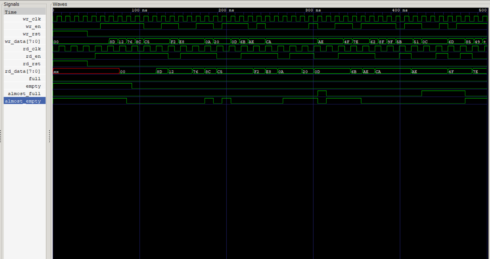

# Async FIFO Verilog

A complete **Asynchronous FIFO (First-In-First-Out)** design written in **Verilog HDL**, enabling safe data transfer between **two independent clock domains**.  
The design uses **Gray-coded pointer synchronization** and **two-flop CDC synchronizers** to mitigate metastability.

Includes a **randomized verification testbench** with simple scoreboard checking and waveform dumping for verification.

---

## ✅ Highlights
- **Dual-clock FIFO** supporting independent read and write clocks
- **Parameterized FIFO depth** using `$clog2()` for scalable design
- **Gray-coded read/write pointers** for safe clock domain crossing
- **Two-flip-flop synchronizers** to reduce metastability risk
- **Full and Empty detection logic**
- **Almost Full / Almost Empty flow-control flags**
- **Randomized verification testbench**
- Waveform generation using **VCD + GTKWave**

---

## ⚙️ Design Overview

### 1) Synchronizer (`sync_2ff.v`)
Implements a **two-flip-flop synchronizer** used for safe pointer transfer between clock domains.

Purpose:
- Reduces metastability during **clock domain crossing (CDC)**

---

### 2) Write Pointer Logic (`write_ptr.v`)
Responsible for:

- Updating the **write pointer**
- Converting binary pointer → **Gray code**
- Detecting **FIFO Full condition**

Key signals:

- `wr_bin` → binary write pointer  
- `wr_gray` → Gray-coded write pointer  
- `full` → indicates FIFO cannot accept new data  

---

### 3) Read Pointer Logic (`read_ptr.v`)
Responsible for:

- Updating the **read pointer**
- Converting binary pointer → **Gray code**
- Detecting **FIFO Empty condition**

Key signals:

- `rd_bin` → binary read pointer  
- `rd_gray` → Gray-coded read pointer  
- `empty` → indicates FIFO contains no data  

---

### 4) FIFO Memory (`fifo_mem.v`)
Implements the **storage array** for FIFO data.

Features:
- Parameterized depth
- Separate **read and write clocks**
- Stores `DATA_WIDTH` wide data words

---

### 5) Top Integration (`async_fifo.v`)
The top module integrates:

- `write_ptr`
- `read_ptr`
- `sync_2ff`
- `fifo_mem`

and exposes a **clean FIFO interface**.

Main interface signals:

| Signal | Description |
|------|------|
| `wr_clk` | Write clock |
| `rd_clk` | Read clock |
| `wr_en` | Write enable |
| `rd_en` | Read enable |
| `wr_data` | Input data |
| `rd_data` | Output data |
| `full` | FIFO full flag |
| `empty` | FIFO empty flag |
| `almost_full` | Near full warning |
| `almost_empty` | Near empty warning |

---

## 🧪 Verification (Randomized Testbench)

The testbench generates **random read and write operations** to stress test FIFO behavior.

Verification checks include:

- Correct **data ordering**
- FIFO **full protection**
- FIFO **empty protection**
- Correct operation of **almost_full / almost_empty flags**

Waveforms are generated using **VCD files** and visualized in **GTKWave**.

---

## ▶️ Simulation (Icarus Verilog)

### ✅ Compile, Run and View Waveform

```bash
iverilog -o sim.out tb/async_fifo_tb.v rtl/*.v
vvp sim.out
gtkwave async_fifo.vcd
```



